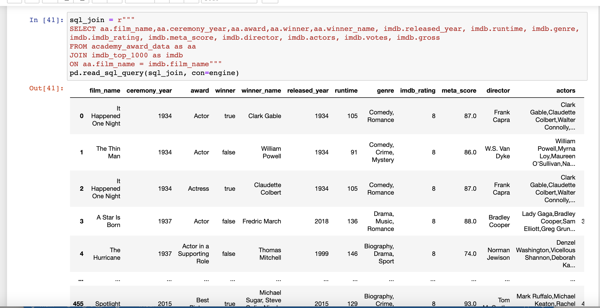

# ETL - Extract, Transform and Load
*An ETL Movies Analysis using Python, RegEx and SQL Databases*




## Project Overview

### Background
Raw data exists in multiple places and forms. In order to perform any kind of data analysis, this data needs to be cleaned and structured. Data pipeline process **ETL – Extract, Transform, and Load** is a core concept in data engineering, ensuring that data is consistent, maintains its integrity, and nontheless strives for automatization of data wrangling. Without a consistent and robust data structure, it’s nearly impossible to perform any meaningful analysis. 


<!-- ABOUT THE PROJECT -->
# Movies-ETL

The purpose of this project was to create an automated pipeline that takes in new data, performs the appropriate transformations, and loads the data into existing tables that is connected to a database. The chosen topic is all about Movies from 1927-2015 and the information from 2 different resources.




An exercise in performing an Extract, Transform, Load (ETL) process to create data pipelines using Python, Pandas and PostgreSQL using very large data files.

This project builds on by performing ETL on two CSV files that contain
- What actors and films have received the most Oscars
- Top 1000 Movies by IMDB Rating





<!-- GETTING STARTED -->
## Getting Started

To get a local copy up and running follow these simple example steps.

### Installation
 
1. Install "PostgreSQL" throught this link https://www.postgresql.org/download/

2. Select your operating system.

3. Click on the "Download the installer" link

4. Download the latest version avaiable

6. Once downloaded, open the installer and follow the steps to complete the installation

5. If you need any help with the installation of PostgreSQL you can find install resoures here https://www.postgresql.org/docs/current/tutorial-install.html


### pgAdmin

1. Clone the repo
   ```sh
   git clone https://github.com/Shaloomi/Project-2.git
   ```
2. Create a config.py file 

3. Inside config.py copy below code and enter your relevant data
   ```sh
   protocol = "postgresql"
   username = "<your username here>"
   password = "<your password here>"
   host = "<your host hear (localhost for local)>"
   port = "<your port here>"
   database_name = "movie_db"
   ```
4. Open pgAmin and create a new database called 
   ```js
   movie_db
   ```
5. Right click on the movie_db database and click on `Query tool`
   
6. Within the Query Tool, open and run file called `queries` located
   ```js
   Where_you_cloned_the_repo + \............\queries.sql
   ```
## Prerequisites
   ```sh
   pip install pandas
   pip install sqlalchemy
   pip install numpy
   ```
## Run notebook
1. Open file called etl_project.ipynb
2. Refresh and clear the kernal
3. Click run all

Results will be displayed. 


## Process

Create an ETL pipeline using Jupyter Notebooks and PostgreSQL from raw data to SQL database.

### Extract 
Import both raw csv files and convert them to pandas data frames so they may be transfomed and loaded into SQL later:
 Both raw CSV's were: (academy_awards_1927-2015.csv) and (imdb_top_1000.csv).
IMDB Movies Dataset from The Movie Database containing movie details with 9964 thousand entries. 
a dataset from The Academy Awards,1927-2015 containing what actors and films have received the most oscar. 


### Transform: 
To start the transformation process we combined the star columns into 1 column of all actors called "actors". We then proceeded to drop all unnecessary columns (Overview, Certificate, Poster_Link and Star1-Star4). Next step was to strip the "min" off the right-hand side of the value in column Runtime column. Once we had all our required columns, we renamed the headers to better suit our data and to match the column headers in Postgres database. Next step was to check if there was any duplicate data in the film_name column. Once we identified there was, we removed the duplicate rows.
The last step(s) in the transformation of the IMDB data is to change all relevant data types to a "INT" datatype. To convert the gross column data into INT type, first we had to replace the commas, found in the values, with no value (ie. Converted value 10,000 to 10000). Still on the gross column, we dropped the NaN values and replaced them with a zero value. We then dropped a value of "PG" found in the released year column with a zero value. And finally, we converted gross, released_year and runtime values into INT datatypes.

The first step in transforming the Academy data was to convert the winner column to be Boolean values. We replaced all NaN values with False and the 1 values with True. We then proceeded to drop the first rows in the dataframe that had multiple year values and the we reset the index
The raw data had some categories listed in the wrong columns: winner and film name. To rectify this we created a new df with the specific categories that have the data in the correct columns and then we rename the column headers to better suited column headers. We then created another df with the specific categories that have the data in the wrong columns. Then renamed the column headers for the second df BUT making sure the film_name and winner_name columns were swapped. Lastly we join the two df's together using the pandas concat method.
Last steps, we drop all unnecessary columns and converted the ceremony_year column to INT datatype.


### Load:
First it connects to the user's SQL database using config for all personal data. Then created an engine to interact with the SQL database as well as an inspector. Then using the inspector to check if both the necessary tables exist within the SQL database. Then import both the imdb panda's data frame as well as the academy panda's data frame into the SQL database as 'imdb_top_1000' and 'academy_award_data' respectively. Then running a select statement to confirm the data has been properly imported. Then finally confirming that both interact with each other by using sqlalchemy to perform a join by joining the academy table and the IMDB table, joining all columns together.


## Summary

Overall, this was a very dense topic to learn and complete in one week. The process of reviewing the data and knowing what to "clean" was challenging, including cross comparison between the datasets, as well as, learning how to use RegEx to parse the text. We expect that to become an expert in ETL, especially RegEx outside of class would require extensive practice and application using real-life examples. We are hoping that with time, we can apply this learning to prepare large datasets for analysis.  

## Citing and referencing

* **Software:** Python 3.7.9, Anaconda 4.9.2, Jupyter Notebooks 6.1.4, PostgreSQL 4.28
* **Libraries:** Pandas, SQLAlchemy, NumPy
* **Data Sources:** IMDB data: 'https://www.kaggle.com/datasets/harshitshankhdhar/imdb-dataset-of-top-1000-movies-and-tv-shows?resource=download' (25/10/2020), 
                  Academy: 'https://www.kaggle.com/datasets/theacademy/academy-awards'(25/10/2020)

<!-- Creators -->
## Creators

Josh Martin, Peregrin Rayan, Udeshi Pereira - [https://github.com/Shaloomi/Project-2.git]

# ETL Movies Project Proposal

### GitHub repo:	
https://github.com/Shaloomi/Project-2.git

### Data sources: 
Both data sources are .csv files from kaggle.com.
The first dataset we are utilising for this project is the academy awards from 1927 to 2015:
https://www.kaggle.com/datasets/theacademy/academy-awards

The second dataset we are utilising is a list of the 1000 most popular shows and movies in IMDBs movie database:
https://www.kaggle.com/datasets/harshitshankhdhar/imdb-dataset-of-top-1000-movies-and-tv-shows?resource=download

### Our pipeline:
We are extracting the data from both .csv files using the pandas library. We are also transforming the data using the pandas library. Then using pyalchemy we are loading the data into our relational SQL database PostgreSQL.

### Final data structure:
Relational SQL database using PGAdmin

### Descriptions of findings:
In data we had found that many of the movies awarded academy awards did match many of the IMDB top movies. However, some academy data had to be removed as they were tv shows or songs that did not match the IMDB data set. In the end we could join 460 academy nominations to the IMDB data set providing extra detail on each movie.

### Responsibilities:

#### Udeshi:
- Readme
- End report

#### Perry:
- Read in csv
- Query to create tables in PGAdmin

#### Josh:
- Transform pandas
- Create table schema

