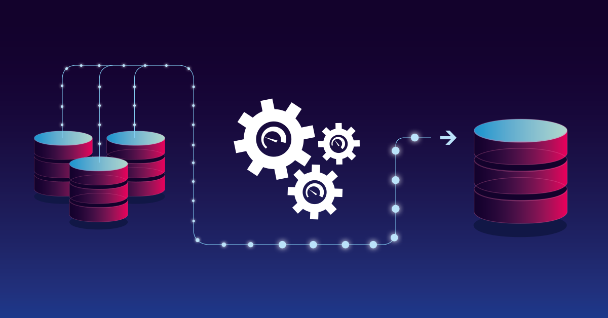

# ETL - Extract, Transform and Load
*An ETL Movies Analysis using Python, RegEx and SQL Databases*




## Project Overview

### Background
Raw data exists in multiple places and forms. In order to perform any kind of data analysis, this data needs to be cleaned and structured. Data pipeline process **ETL – Extract, Transform, and Load** is a core concept in data engineering, ensuring that data is consistent, maintains its integrity, and nontheless strives for automatization of data wrangling. Without a consistent and robust data structure, it’s nearly impossible to perform any meaningful analysis. 


<!-- ABOUT THE PROJECT -->
# Movies-ETL

The purpose of this project was to create an automated pipeline that takes in new data, performs the appropriate transformations, and loads the data into existing tables that is connected to a database. The chosen topic is all about Movies from 1990 to 2018 and combining the information from 2 different resources.




An exercise in performing an Extract, Transform, Load (ETL) process to create data pipelines using Python, Pandas and PostgreSQL using very large data files.

This project builds on by performing ETL on two CSV files that contain
- What actors and films have received the most Oscars
- Top 1000 Movies by IMDB Rating





<!-- GETTING STARTED -->
## Getting Started

To get a local copy up and running follow these simple example steps.

### Installation
 
1. Install "PostgreSQL" throught this link https://www.postgresql.org/download/

2. Select your operating system.

3. Click on the "Download the installer" link

4. Download the latest version avaiable

6. Once downloaded, open the installer and follow the steps to complete the installation

5. If you need any help with the installation of PostgreSQL you can find install resoures here https://www.postgresql.org/docs/current/tutorial-install.html


### pgAdmin

1. Clone the repo
   ```sh
   git clone https://github.com/Shaloomi/Project-2.git
   ```
2. Open pgAmin and create a new database called 
   ```js
   ...................
   ```
3. Right click on the sql-challenge database and click on `Query tool`
   
4. Within the Query Tool, open and run file called `schema` located
   ```js
   Where_you_cloned_the_repo + \............\queries.sql\schema
   ```

    You now have your tables and columns created. We will next step over how to read in your csv files.

### Note: You will need to import data into the tables in the following order.

    * Year
    * Ceremony
    * Award
    * Winner
    * Name
    * Film

5. Expand the sql-challenge databse, then Schemas, public and then Tables

6. Right click on the table then select Import/Export Data

7. In this window click on Options and make sure Header is selected

8. Click on General and then click on the file name

9. Locate the applicable csv relatined to the table you have selected ie. If you have slected departments as the table you need to select departments as the csv file.

10. Then click OK

11. Repeat ths process for all tables ensuring you complete this in the correct order.


Before we can run our analysis we have to run a query to convert text to date.


12. Right click on the sql-challenge database and click on `Query tool`
   
13. Within the Query Tool, open and run file called `convert_text_to_date` located
   ```js
   Where_you_cloned_the_repo + \...........\queries.sql\convert_text_to_date
```

Lastly we run our analysis query

14. Right click on the ............. database and click on `Query tool`
   
15. Within the Query Tool, open and run file called `queries` located
   ```js
   Where_you_cloned_the_repo + \...........\queries.sql\queries
```

<!-- Creators -->
## Creators

Josh Martin, Peregrin Rayan, Udeshi Pereira - [https://github.com/Shaloomi/Project-2.git]

## Process

Create an ETL pipeline using Jupyter Notebooks and PostgreSQL from raw data to SQL database.

* **Extract:** read data from multiple sources using Python. Data sourced from:
	* **Kaggle:** - 2 files (academy_awards_1927-2015.csv) and (imdb_top_1000.csv)
		* a IMDB Movies Dataset from The Movie Database containing movie details with 9964 thousand entries. 
		* a dataset from The Academy Awards,1927-2015 containing what actors and films have received the most oscar. 
* **Transform:** Clean and structure data using Pandas and regular expressions (RegEx) to achieve desired form. (i.e. using RegEx to parse data and transform text into numbers.
	* Deleting bad data (corrupted or missing), removing duplicate rows, and consolidating columns.
	* Using RegEx to parse data and transform text into numbers.




* **Load:** Export transformed data into a database.

## Results



We were able to clean, merge the datasets and export the two new tables into PostgreSQL by using Python. 




## Summary

Overall, this was a very dense topic to learn and complete in one week. The process of reviewing the data and knowing what to "clean" was challenging, including cross comparison between the datasets, as well as, learning how to use RegEx to parse the text. We expect that to become an expert in ETL, especially RegEx outside of class would require extensive practice and application using real-life examples. We are hoping that with time, we can apply this learning to prepare large datasets for analysis.  

## Resources
* **Software:** Python 3.7.9, Anaconda 4.9.2, Jupyter Notebooks 6.1.4, PostgreSQL 4.28
* **Libraries:** Pandas, SQLAlchemy, NumPy

## Troubleshooting

